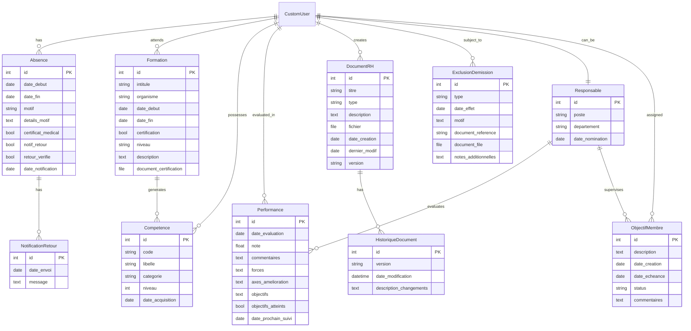

```mermaid
erDiagram
    CustomUser ||--o{ Absence : "has"
    CustomUser ||--o{ Formation : "attends"
    CustomUser ||--o{ Competence : "possesses"
    CustomUser ||--o{ Performance : "evaluated_in"
    CustomUser ||--o{ DocumentRH : "creates"
    CustomUser ||--o{ ExclusionDemission : "subject_to"
    CustomUser ||--|| Responsable : "can_be"
    CustomUser ||--o{ ObjectifMembre : "assigned"
    
    Absence {
        int id PK
        date date_debut
        date date_fin
        string motif
        text details_motif
        bool certificat_medical
        bool notif_retour
        bool retour_verifie
        date date_notification
    }
    
    Absence ||--o{ NotificationRetour : "has"
    
    NotificationRetour {
        int id PK
        date date_envoi
        text message
    }
    
    Formation {
        int id PK
        string intitule
        string organisme
        date date_debut
        date date_fin
        bool certification
        string niveau
        text description
        file document_certification
    }
    
    Formation ||--o{ Competence : "generates"
    
    Competence {
        int id PK
        string code
        string libelle
        string categorie
        int niveau
        date date_acquisition
    }
    
    Responsable {
        int id PK
        string poste
        string departement
        date date_nomination
    }
    
    Responsable ||--o{ Performance : "evaluates"
    Responsable ||--o{ ObjectifMembre : "supervises"
    
    Performance {
        int id PK
        date date_evaluation
        float note
        text commentaires
        text forces
        text axes_amelioration
        text objectifs
        bool objectifs_atteints
        date date_prochain_suivi
    }
    
    DocumentRH {
        int id PK
        string titre
        string type
        text description
        file fichier
        date date_creation
        date dernier_modif
        string version
    }
    
    DocumentRH ||--o{ HistoriqueDocument : "has"
    
    HistoriqueDocument {
        int id PK
        string version
        datetime date_modification
        text description_changements
    }
    
    ExclusionDemission {
        int id PK
        string type
        date date_effet
        text motif
        string document_reference
        file document_file
        text notes_additionnelles
    }
    
    ObjectifMembre {
        int id PK
        text description
        date date_creation
        date date_echeance
        string status
        text commentaires
    }
```
