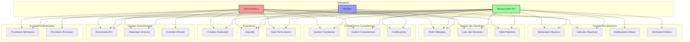

```mermaid
graph TD
    subgraph "Utilisateurs"
        A1[Administrateur]
        A2[Responsable RH]
        A3[Membre]
    end
    
    subgraph "Gestion des Membres"
        B1[Profil Utilisateur]
        B2[Liste des Membres]
        B3[Détail Membre]
    end
    
    subgraph "Gestion des Absences"
        C1[Déclaration Absence]
        C2[Liste des Absences]
        C3[Notifications Retour]
        C4[Vérification Retour]
    end
    
    subgraph "Formations et Compétences"
        D1[Gestion Formations]
        D2[Gestion Compétences]
        D3[Certifications]
    end
    
    subgraph "Évaluations"
        E1[Création Évaluation]
        E2[Objectifs]
        E3[Suivi Performance]
    end
    
    subgraph "Gestion Documentaire"
        F1[Documents RH]
        F2[Historique Versions]
        F3[Contrôle d'Accès]
    end
    
    subgraph "Exclusions/Démissions"
        G1[Procédure Démission]
        G2[Procédure Exclusion]
    end
    
    A1 --> B1
    A1 --> B2
    A1 --> B3
    A1 --> C2
    A1 --> D1
    A1 --> D2
    A1 --> E1
    A1 --> E2
    A1 --> E3
    A1 --> F1
    A1 --> F2
    A1 --> F3
    A1 --> G1
    A1 --> G2
    
    A2 --> B1
    A2 --> B2
    A2 --> B3
    A2 --> C1
    A2 --> C2
    A2 --> C3
    A2 --> C4
    A2 --> D1
    A2 --> D2
    A2 --> D3
    A2 --> E1
    A2 --> E2
    A2 --> E3
    A2 --> F1
    A2 --> F2
    A2 --> G1
    
    A3 --> B1
    A3 --> C1
    A3 --> D3
    A3 --> E2
    A3 --> F1
    
    classDef admin fill:#ff9999,stroke:#333,stroke-width:2px
    classDef rh fill:#99ff99,stroke:#333,stroke-width:2px
    classDef membre fill:#9999ff,stroke:#333,stroke-width:2px
    
    class A1 admin
    class A2 rh
    class A3 membre
```
